# 🤖 Robô TSB (Controle de Turno e Telemetria)

Uma solução de RPA (Robotic Process Automation) robusta desenvolvida em Python para automatizar o processo de consolidação de dados de turnos de trabalho (GPM), telemetria veicular (ZUQ) e batidas de ponto (Pontomais). O robô cruza essas informações em lote (batch), gera relatórios diários unificados por operação e realiza o upload dos resultados para o Google Drive, além de atualizar planilhas de controle de status no Google Sheets.

---

## 🏗️ Arquitetura do Projeto

O robô é estruturado de forma modular para segmentar responsabilidades de integração de APIs, automação de navegadores, tratamento de dados e persistência de estado.

A tabela abaixo descreve o papel de cada componente do projeto no repositório:

| Arquivo/Pasta | Função e Descrição |
| :--- | :--- |
| [**`main.py`**](./main.py) | **Ponto de entrada (Entrypoint)**. Orquestra toda a execução: limpa pastas temporárias, define o período a processar, faz chamadas de download, executa o processamento, realiza o upload final e atualiza os arquivos/planilhas de status. |
| [**`download_gpm.py`**](./download_gpm.py) | **Automação Web do GPM**. Inicializa o Firefox via Selenium WebDriver para efetuar login nos portais da Bahia (BA) e Ceará (CE) do sistema GPM, navegando e exportando o relatório de turnos (`#GR412`) em fatias periódicas. Possui fallback de scraping via JS. |
| [**`api_zuq.py`**](./api_zuq.py) | **Integração com a API ZUQ**. Realiza requisições HTTPS para a API de telemetria da ZUQ para obter os registros de hodômetro e eventos de veículos. Realiza fatiamento de 30 em 30 dias para evitar erros em consultas longas. |
| [**`gsheets.py`**](./gsheets.py) | **Integração com Google Drive/Sheets API**. Gerencia autenticação OAuth2, leitura de credenciais GPM nas planilhas corporativas, download de planilhas consolidadas do Pontomais e upload dos relatórios consolidados finais. |
| [**`data_analysis.py`**](./data_analysis.py) | **Processamento e Cruzamento de Dados (Pandas)**. Limpa e enriquece os dados de turnos do GPM, realiza o cruzamento de equipes/datas com batidas de ponto (Pontomais) e telemetria (ZUQ) com alta performance (operações vetorizadas), gerando os arquivos diários unificados. |
| [**`auxiliar.py`**](./auxiliar.py) | **Configurações e Variáveis Globais**. Configura os diretórios de trabalho, carrega o arquivo `.env` (em execução local) e expõe caminhos de pastas e variáveis de ambiente padronizadas. |
| [**`get_date_run.py`**](./get_date_run.py) | **Gerenciador de Ciclo de Datas**. Utilitário responsável por interagir com o arquivo `config.json` para obter a data inicial do lote de execução e avançar essa data em +1 dia no final de um ciclo concluído com sucesso. |
| [**`upload_drive.py`**](./upload_drive.py) | **Script de Contingência**. Script independente que pode ser disparado manualmente para fazer o upload de todos os arquivos presentes no diretório `app/final/` para a pasta final do Google Drive, caso a execução principal falhe nesta etapa. |
| [**`config.json`**](./config.json) | **Persistência de Estado**. Arquivo que armazena a data inicial (`initial_date`) pendente de processamento para orientar a próxima execução do robô. |
| [**`requirements.txt`**](./requirements.txt) | **Dependências do Python**. Lista as bibliotecas do projeto (como `pandas`, `selenium`, `gspread`, `google-api-python-client`, `requests`, `python-dotenv`). |
| [**`app/`**](./app) | **Pasta de Trabalho do Robô**. Diretório raiz de processamento que contém a chave [`chaveGoogle.json`](./app/chaveGoogle.json) e as subpastas `downloads/` (arquivos brutos do navegador), `temp/` (arquivos intermediários) e `final/` (relatórios gerados prontos para upload). |
| [**`.github/workflows/workflow.yml`**](./.github/workflows/workflow.yml) | **Pipeline CI/CD**. Arquivo que define o fluxo do GitHub Actions, incluindo agendamento, instalação de dependências, injeção de variáveis de ambiente e commits automáticos do `config.json`. |

---

## 🔑 Integrações e Credenciais

O robô consome dados e publica resultados em serviços externos. A autenticação e parametrização dependem dos seguintes arquivos e variáveis de ambiente:

### 1. Conta de Serviço do Google (OAuth2)
Para interagir com o Google Drive e o Google Sheets, o robô utiliza uma conta de serviço Google.
*   **Arquivo Físico**: O robô busca a credencial em [`app/chaveGoogle.json`](./app/chaveGoogle.json) (ou como fallback na raiz do repositório).
*   **Execução em Nuvem (GitHub Actions)**:
    *   O conteúdo em formato texto do arquivo de chaves deve ser guardado como uma **Secret** do GitHub chamada `GOOGLE_CREDENTIALS_JSON`.
    *   No início do workflow, o robô detecta essa variável e cria automaticamente o arquivo [`app/chaveGoogle.json`](./app/chaveGoogle.json) em disco, evitando a necessidade de versionar credenciais no Git.

### 2. Variáveis de Ambiente (`.env` / GitHub Environment Variables)
As seguintes variáveis devem estar configuradas no arquivo `.env` (para execuções locais) ou nas abas *Variables / Secrets* do repositório no GitHub:

| Nome da Variável | Origem | Descrição | Exemplo |
| :--- | :--- | :--- | :--- |
| `ID_PLANILHA_GSHEET` | Variable | ID da planilha que contém os acessos criptografados do portal GPM. | `1odD_fRayhYp9wAkG...` |
| `ID_PLANILHA_ATT_GSHEET` | Variable | ID da planilha do Google Sheets onde o robô escreve o timestamp de última execução. | `1lM8Q3NIUrDsdR8OD...` |
| `ID_PASTA_DRIVE_FINAL` | Variable | ID da pasta do Google Drive onde os relatórios consolidados diários finais são publicados. | `1G6z_L0dAwLSyx8GU...` |
| `TOKEN_ZUQ` | Secret/Variable | Token de autorização Bearer para as chamadas na API de telemetria ZUQ. | `Bearer QQ5R0DL2WW50N...` |
| `LOGIN_GPM` | Secret/Variable | Usuário de acesso ao GPM (utilizado como fallback caso a planilha de acessos falhe). | `usuario_gpm` |
| `SENHA_GPM` | Secret/Variable | Senha de acesso ao GPM (utilizada como fallback caso a planilha de acessos falhe). | `senha_gpm` |
| `ID_PLANILHA_CONTROLE` | Variable | ID da planilha de controle geral de robôs para fallback de leitura de datas. | `1lM8Q3NIUrDs...` |
| `NOME_ABA_CONTROLE` | Variable | Nome da aba dentro da planilha de controle de datas de robôs. | `Att_TSB` |
| `CELULA_DATA_CONTROLE` | Variable | Célula onde o robô consulta/atualiza a data de processamento. | `A2` |

---

## 📊 Diagrama de Processamento

O fluxograma abaixo descreve em detalhes como o processamento é executado, cobrindo o download dos relatórios brutos, contingências, o pipeline de cruzamento com Pandas e a publicação dos relatórios:

```mermaid
graph TD
    A([Início do Robô]) --> B[Carregar Env / .env]
    B --> C[Obter Data do config.json via getInitialDate]
    C --> D{Data de Execução > Ontem?}
    D -- Sim --> E([Fim: Tudo Processado])
    D -- Não --> F[Limpar app/downloads/ e app/temp/]
    
    F --> G[Chamar API ZUQ por lotes de 30 dias]
    G --> H[Salvar telemetria em notifications_report.json]
    
    H --> I[Listar & baixar arquivos Pontomais do Drive]
    I --> J[Mesclar arquivos e salvar Pontomais_final.xlsx]
    
    J --> K[Selecionar Operação: BA ou CE]
    
    K --> L[Obter credencial GPM via gsheets.acessos]
    L --> M[Inicializar Firefox via Selenium]
    M --> N[Logar no GPM e acessar Consulta de Turno #GR412]
    N --> O[Fatiar período em intervalos de 7 dias]
    O --> P[Configurar datas no portal e pesquisar]
    P --> Q{Botão Excel/CSV Padrão funciona?}
    Q -- Sim --> R[Baixar ZIP e descompactar CSV no app/downloads]
    Q -- Não --> S[Executar script JS de Contingência para Scraping direto da tela]
    R & S --> T[Renomear e mover CSV para app/temp como chunk]
    T --> U{Há mais fatias no período?}
    U -- Sim --> O
    U -- Não --> V[Concatenar todos os chunks em consulta turno OPERACAO.csv]
    
    V --> W{Há mais operações?}
    W -- Sim --> K
    W -- Não --> X[Iniciar Cruzamento de Dados no Pandas]
    
    X --> Y[Limpar e formatar campos de turnos GPM]
    Y --> Z[Cruzamento GPM x Pontomais por Nome do Parceiro + Data do Serviço]
    Z --> AA[Cruzamento GPM x Telemetria ZUQ por Placa do Veículo + Data do Serviço]
    AA --> AB[Salvar arquivos consolidados por dia na pasta app/final/]
    
    AB --> AC[Upload de todos os arquivos consolidados para o Google Drive]
    AC --> AD[Escrever data de conclusão +1 dia no config.json]
    AD --> AE[Gravar data/hora da execução na planilha de status do Sheets]
    AE --> AF([Fim de Execução com Sucesso])
```



---

## 🚀 Instruções de Execução

### 💻 Execução Local (Ambiente de Desenvolvimento)

Para executar o robô na sua máquina de desenvolvimento local (Windows):

1.  **Pré-requisitos**:
    *   Python `3.12` instalado.
    *   Navegador Mozilla Firefox instalado.
    *   Geckodriver instalado no sistema (opcional: o Selenium Manager moderno baixa o driver compatível dinamicamente).

2.  **Configuração de Ambiente Virtual (venv)**:
    Abra o terminal/PowerShell no diretório do projeto e execute:
    ```powershell
    python -m venv venv
    .\venv\Scripts\activate
    ```

3.  **Instalação das Bibliotecas**:
    ```powershell
    pip install -r requirements.txt
    ```

4.  **Criação do Arquivo `.env`**:
    Crie o arquivo `.env` na raiz do projeto conforme o modelo descrito na seção de credenciais.

5.  **Arquivo de Chaves Google**:
    Coloque o arquivo de chave JSON da conta de serviço Google no caminho: `app/chaveGoogle.json`.

6.  **Inicialização**:
    ```powershell
    python main.py
    ```
    *Nota: Por padrão, a execução local roda com a interface visual do navegador ativa para facilitar o acompanhamento. Se desejar rodar em modo silencioso, exporte a variável `GITHUB_ACTIONS=true` no console antes de executar.*

---

### ☁️ Execução na Nuvem (GitHub Actions)

A automação é orquestrada por meio do workflow localizado em [`.github/workflows/workflow.yml`](./.github/workflows/workflow.yml).

*   **Agendamentos (Triggers)**:
    *   **Execução Automática**: Disparada diariamente via Cron às **07:00 UTC** (equivalente a `04:00` da manhã no fuso horário oficial de Brasília `America/Sao_Paulo`).
    *   **Execução Manual**: Ativada por meio do mecanismo `workflow_dispatch` diretamente na interface do repositório no GitHub.

*   **Modo Headless do Navegador (Sem ambiente gráfico físico)**:
    *   Ao contrário de soluções que exigem a simulação de telas virtuais como o `Xvfb` (`xvfb-run`), este robô é otimizado para rodar de forma nativa e leve em servidores virtuais Linux Linux (`ubuntu-latest`).
    *   O script `download_gpm.py` identifica a variável de ambiente `GITHUB_ACTIONS: "true"` configurada no workflow e instrui o Selenium a abrir o **Firefox em modo Headless nativo** (`self.options.add_argument('--headless')`). Isso elimina qualquer necessidade de configurações complexas de X-Server ou dependências externas no sistema operacional Linux da Action.

*   **Persistência da Data do Ciclo**:
    *   O robô processa em lote até o dia anterior da execução ("ontem").
    *   Ao finalizar o lote, a nova data inicial de processamento é escrita de volta no arquivo `config.json`.
    *   O GitHub Actions roda passos do Git para realizar o commit e o push desse arquivo de configuração atualizado para o repositório principal no GitHub, garantindo que o próximo ciclo inicie exatamente a partir do dia seguinte do último processamento com sucesso.
